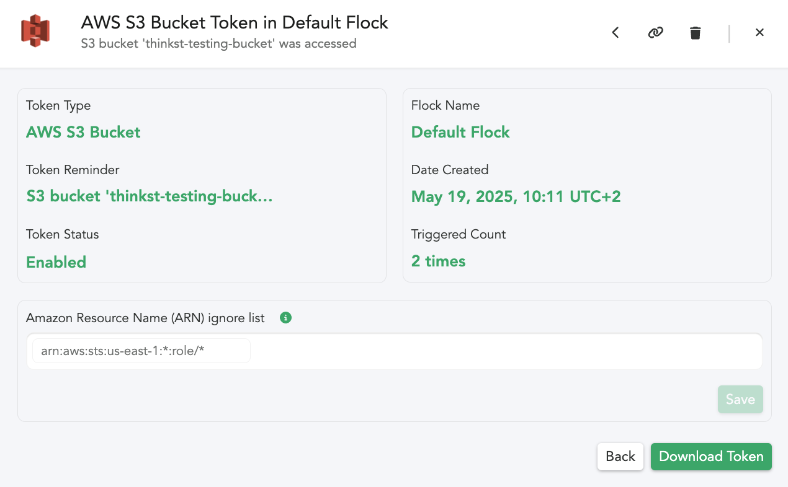

---
endpoints:
  disable:
    name: Disable AWS S3 Bucket Canarytoken ARN Ignore List
    url: /api/v1/canarytokens/s3bucket/ignorelist/disable
    method: POST
    description: Disable the ARN ignore list for a specific AWS S3 Bucket Canarytoken.
    params:
      - name: auth_token
        required: true
        type: string
        description: A valid auth token
      - name: flock_id
        required: true
        type: string
        description: A valid flock_id
      - name: canarytoken
        required: true
        type: string
        description: A valid AWS S3 Bucket Canarytoken
    response: A JSON structure with result indicator.
  enable:
    name: Enable AWS S3 Bucket Canarytoken ARN Ignore List
    url: /api/v1/canarytokens/s3bucket/ignorelist/enable
    method: POST
    description: Enable the ARN ignore list for a specific AWS S3 Bucket Canarytoken.
    params:
      - name: auth_token
        required: true
        type: string
        description: A valid auth token
      - name: flock_id
        required: true
        type: string
        description: A valid flock_id
      - name: canarytoken
        required: true
        type: string
        description: A valid AWS S3 Bucket Canarytoken
    response: A JSON structure with result indicator.
  fetch:
    name: Fetch AWS S3 Bucket Canarytoken ARN Ignore List
    url: /api/v1/canarytokens/s3bucket/ignorelist/fetch
    method: GET
    description: Fetch the ARN ignore list for a specific AWS S3 Bucket Canarytoken.
    params:
      - name: auth_token
        required: true
        type: string
        description: A valid auth token
      - name: flock_id
        required: true
        type: string
        description: A valid flock_id
      - name: canarytoken
        required: true
        type: string
        description: A valid AWS S3 Bucket Canarytoken
    response: A JSON structure containing the ARN ignore list for the specified AWS S3 Bucket Canarytoken.
  save:
    name: Save AWS S3 Bucket Canarytoken ARN Ignore List
    url: /api/v1/canarytokens/s3bucket/ignorelist/save
    method: POST
    description: Save a new ARN ignore list for a specific AWS S3 Bucket Canarytoken.
    params:
      - name: auth_token
        required: true
        type: string
        description: A valid auth token
      - name: flock_id
        required: true
        type: string
        description: A valid flock_id
      - name: canarytoken
        required: true
        type: string
        description: A valid AWS S3 Bucket Canarytoken
      - name: ignores
        required: false
        type: string
        description: A space separated list of ARNs or ARN patterns.
    response: A JSON structure with result indicator.
---

# AWS S3 Bucket Canarytoken ARN ignore list

<APIEndpoints :endpoints="$page.frontmatter.endpoints" :path="$page.regularPath">

::::: slot details


An AWS S3 Bucket Canarytoken monitors an S3 bucket of your choosing and generates an alert when that bucket is accessed.

The Amazon Resource Names (ARNs) of AWS resources that legitimately need access to the bucket can be added to the ARN ignore list of the Canarytoken, preventing alerts from being generated when they access the bucket.



:::::

</APIEndpoints>

## Disable the ARN ignore list for a specific AWS S3 Bucket Canarytoken

<APIDetails :endpoint="$page.frontmatter.endpoints.disable">

::::: slot example

:::: tabs :options="{ useUrlFragment: false }"

::: tab "cURL"

``` bash
curl https://EXAMPLE.canary.tools/api/v1/canarytokens/s3bucket/ignorelist/disable \
  -d auth_token=EXAMPLE_AUTH_TOKEN \
  -d flock_id=flock:default \
  -d canarytoken=EXAMPLE_AWS_S3_BUCKET_CANARYTOKEN
```

:::

::: tab "Python"

``` python
import requests

url = 'https://EXAMPLE.canary.tools/api/v1/canarytokens/s3bucket/ignorelist/disable'

payload = {
  'auth_token': 'EXAMPLE_AUTH_TOKEN',
  'flock_id': 'flock:default',
  'canarytoken': 'EXAMPLE_AWS_S3_BUCKET_CANARYTOKEN'
}

r = requests.post(url, data=payload)

print(r.json())
```

:::

::::


::: api-response
```json
{
  "result": "success"
}
```
:::

:::::

</APIDetails>

## Enable the ARN ignore list for a specific AWS S3 Bucket Canarytoken

<APIDetails :endpoint="$page.frontmatter.endpoints.enable">

::::: slot example

:::: tabs :options="{ useUrlFragment: false }"

::: tab "cURL"

``` bash
curl https://EXAMPLE.canary.tools/api/v1/canarytokens/s3bucket/ignorelist/enable \
  -d auth_token=EXAMPLE_AUTH_TOKEN \
  -d flock_id=flock:default \
  -d canarytoken=EXAMPLE_AWS_S3_BUCKET_CANARYTOKEN
```

:::

::: tab "Python"

``` python
import requests

url = 'https://EXAMPLE.canary.tools/api/v1/canarytokens/s3bucket/ignorelist/enable'

payload = {
  'auth_token': 'EXAMPLE_AUTH_TOKEN',
  'flock_id': 'flock:default',
  'canarytoken': 'EXAMPLE_AWS_S3_BUCKET_CANARYTOKEN'
}

r = requests.post(url, data=payload)

print(r.json())
```

:::

::::


::: api-response
```json
{
  "result": "success"
}
```
:::

:::::

</APIDetails>

## Fetch an AWS S3 Bucket Canarytoken ARN Ignore List

<APIDetails :endpoint="$page.frontmatter.endpoints.fetch">

::::: slot example

:::: tabs :options="{ useUrlFragment: false }"

::: tab "cURL"

``` bash
curl https://EXAMPLE.canary.tools/api/v1/canarytokens/s3bucket/ignorelist/fetch \
  -d auth_token=EXAMPLE_AUTH_TOKEN \
  -d flock_id=flock:default \
  -d canarytoken=EXAMPLE_AWS_S3_BUCKET_CANARYTOKEN \
  -G
```

:::

::: tab "Python"

``` python
import requests

url = 'https://EXAMPLE.canary.tools/api/v1/canarytokens/s3bucket/ignorelist/fetch'

payload = {
  'auth_token': 'EXAMPLE_AUTH_TOKEN',
  'flock_id': 'flock:default',
  'canarytoken': 'EXAMPLE_AWS_S3_BUCKET_CANARYTOKEN'
}

r = requests.get(url, params=payload)

print(r.json())
```

:::

::::


::: api-response
```json
{
  "ignore_lists": {
    "enabled": "true",
    "ignores": "arn:aws:sts:us-east-1:*:role/*"
  },
  "result": "success"
}
```
:::

:::::

</APIDetails>

## Save an AWS S3 Bucket Canarytoken ARN Ignore List

<APIDetails :endpoint="$page.frontmatter.endpoints.save">

::: slot optional-parameters-notes

::: warning
Sending through a save without `ignores`, will assume you want to blank previously set values.
:::

:::

::::: slot example

:::: tabs :options="{ useUrlFragment: false }"

::: tab "cURL"

``` bash
curl https://EXAMPLE.canary.tools/api/v1/canarytokens/s3bucket/ignorelist/save \
  -d auth_token=EXAMPLE_AUTH_TOKEN \
  -d flock_id=flock:default \
  -d canarytoken=EXAMPLE_AWS_S3_BUCKET_CANARYTOKEN \
  -d ignores='arn:aws:sts:us-east-1:123456789012:example/folder arn:aws-cn:iam::123456789012:example/folder'
```

:::

::: tab "Python"

``` python
import requests

url = 'https://EXAMPLE.canary.tools/api/v1/canarytokens/s3bucket/ignorelist/save'

payload = {
  'auth_token': 'EXAMPLE_AUTH_TOKEN',
  'flock_id': 'flock:default',
  'canarytoken': 'EXAMPLE_AWS_S3_BUCKET_CANARYTOKEN',
  'ignores':'arn:aws:sts:us-east-1:123456789012:example/folder arn:aws-cn:iam::123456789012:example/folder'
}

r = requests.post(url, data=payload)

print(r.json())
```

:::

::::


::: api-response
```json
{
  "result": "success"
}
```
:::

:::::

</APIDetails>