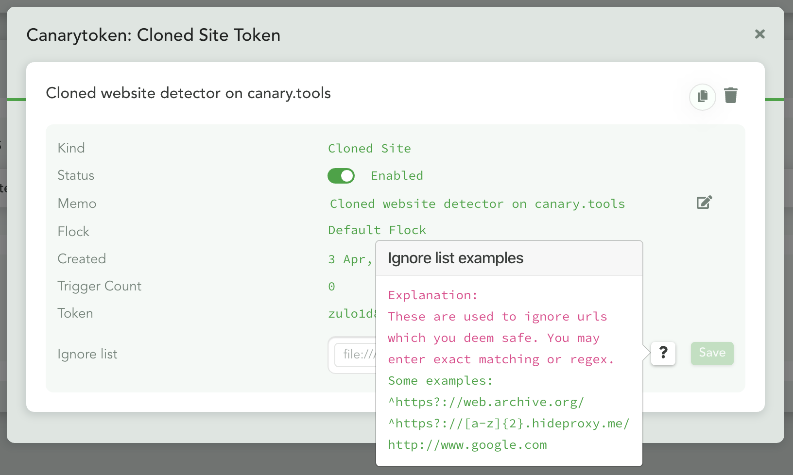

---
endpoints:
  disable:
    name: Disable Ignore List
    url: /api/v1/canarytokens/clonedsite/ignorelist/disable
    method: POST
    description: Disable the ignore list for a specific Cloned Web token.
    params:
      - name: auth_token
        required: true
        type: string
        description: A valid auth token
      - name: flock_id
        required: true
        type: string
        description: A valid flock_id
      - name: canarytoken
        required: true
        type: string
        description: A valid Canarytoken
    response: A JSON structure with result indicator.
  enable:
    name: Enable Ignore List
    url: /api/v1/canarytokens/clonedsite/ignorelist/enable
    method: POST
    description: Enable the ignore list for a specific Cloned Web token.
    params:
      - name: auth_token
        required: true
        type: string
        description: A valid auth token
      - name: flock_id
        required: true
        type: string
        description: A valid flock_id
      - name: canarytoken
        required: true
        type: string
        description: A valid Canarytoken
    response: A JSON structure with result indicator.
  fetch:
    name: Fetch Ignore List
    url: /api/v1/canarytokens/clonedsite/ignorelist/fetch
    method: GET
    description: Enable the ignore list for a specific Cloned Web token.
    params:
      - name: auth_token
        required: true
        type: string
        description: A valid auth token
      - name: flock_id
        required: true
        type: string
        description: A valid flock_id
      - name: canarytoken
        required: true
        type: string
        description: A valid Canarytoken
    response: A JSON structure containing the ignore list info for the specified Cloned Web token.
  save:
    name: Save Ignore List
    url: /api/v1/canarytokens/clonedsite/ignorelist/save
    method: POST
    description: Save a new ignore list for a specific Cloned Web token.
    params:
      - name: auth_token
        required: true
        type: string
        description: A valid auth token
      - name: flock_id
        required: true
        type: string
        description: A valid flock_id
      - name: canarytoken
        required: true
        type: string
        description: A valid Canarytoken
      - name: ignores
        required: false
        type: string
        description: A comma separated list of regex ignores
    response: A JSON structure with result indicator.
---

# Cloned Web Ignore list

We have added the ability to add your own regex or website to be ignored when alerting for Cloned web Canarytokens.

This is useful if you see that your Cloned Web token is generating alerts that you deem "safe".

<APIEndpoints :endpoints="$page.frontmatter.endpoints" :path="$page.regularPath"/>

## Disable Ignore List

<APIDetails :endpoint="$page.frontmatter.endpoints.disable"/>

## Enable Ignore List

<APIDetails :endpoint="$page.frontmatter.endpoints.enable"/>

## Fetch Ignore List

<APIDetails :endpoint="$page.frontmatter.endpoints.fetch"/>

## Save Ignore List

<APIDetails :endpoint="$page.frontmatter.endpoints.save">

::: slot optional-parameters-notes

::: warning
Sending through a save without `ignores`, will assume you want to blank previously set values.
:::

:::

</APIDetails>