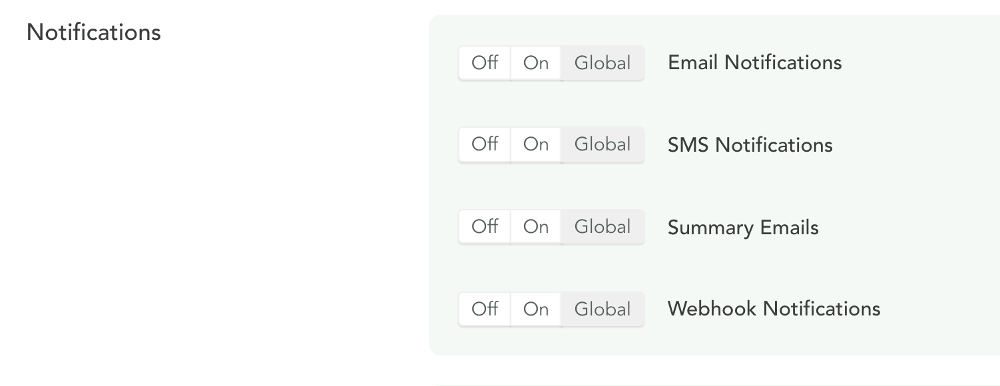

# Overview
 

  

  
A Flock's settings can be in one of three states:

  - `enabled`
  - `disabled`
  - `global`

If set to `global`, it will inherit its settings from the [Global Settings](/console-settings/notification-settings.html).

If set to `enabled`, it will be enabled for that Flock and pull any extra related settings from that Flock.

If set to `disabled`, it will be disabled for that Flock.

This gives you the ability to configure settings on a Console-wide level, as well as individual Flock-level if you see fit.

Some Flock settings, such as [Canary Limits](/flocks-settings/canary-limits.html), are managed through dedicated endpoints.

  

  

  

