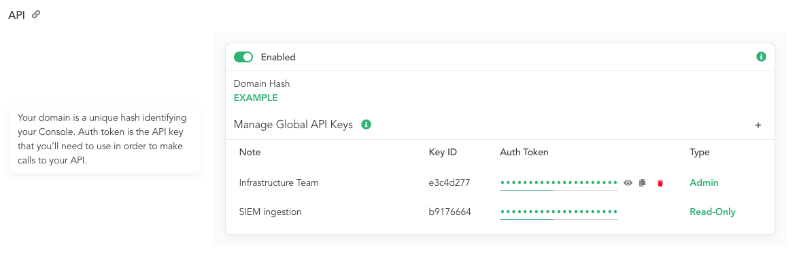
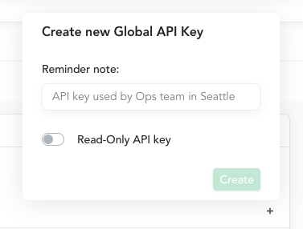

# Getting Started

In this section we'll walk through the basics of connecting to your Console using the API.

Before being able to use the examples, you're going to need to find out your `DOMAIN` and `AUTH_TOKEN`.

## API Details

<div class="section-container">

  <div class="details-content">

`DOMAIN` is the unique hash identifying your Console. In our examples, we'll be using `EXAMPLE`.

`AUTH_TOKEN` is the API key that you'll need to use in order to make calls to your API. We'll use `EXAMPLE_AUTH_TOKEN` throughout the examples.

Both of these can be obtained by navigating to `/settings` on your Console, and looking at the API section.

`AUTH_TOKEN` can be viewed by clicking the 'eye' icon next to the key. (In the future, the auth_token will only be shown when it is created, so viewing after creation should be considered deprecated)

API keys are created with an `Admin` or `Read-Only` role and a `Note` to remind you of its purpose. These are fixed at creation. To change these, simply create a new API Key, rotate out the use of the old API Key, and delete the old API Key. Additionally a `Key ID` will be generated for each API Key that is used to help identify the key used in logs, and for use in key management endpoints.

NOTE: If you had a console key generated before the `Read-Only` API key feature was released your `AUTH_TOKEN` will be migrated and assigned a note of `Default API Key` and a `Key ID` of `ffffffff`

  </div>

  <div class="example-content">




  </div>
</div>

## Hello Console


<div class="section-container">

  <div class="details-content">

Let's begin by ensuring that we can successfully contact our Console. We can do this by calling the [Ping](/console/testing.html#ping) endpoint.

If you see the `success` result you're good to go!

  </div>
  <div class="example-content">

:::: tabs :options="{ useUrlFragment: false }"

::: tab "cURL"

``` bash
curl https://EXAMPLE.canary.tools/api/v1/ping \
  -d auth_token=EXAMPLE_AUTH_TOKEN \
  -G
```

:::


::: tab "Python"

``` python
import requests

url = 'https://EXAMPLE.canary.tools/api/v1/ping'

payload = {
  'auth_token': 'EXAMPLE_AUTH_TOKEN'
}

r = requests.get(url, params=payload)

print(r.json())
```

:::

::::

:::  api-response 
``` json
{
  "result": "success"
}
```
:::

  </div>
</div>
<div class="section-container">
  <div class="details-content">


If you instead see an `error` result, you can examine the `message` field to determine what the cause might be. For example, if you used an invalid `auth_token` you would see a response similar to:

  </div>

  <div class="example-content">

::: api-response
```json
{
  "message": "Invalid auth_token",
  "result": "error"
}
```
:::

  </div>
</div>

## API Key as an HTTP header


<div class="section-container">

  <div class="details-content">

This documentation defaults to using the API key as a URL parameter, but it can also be specified as an HTTP header.

The header name is `X-Canary-Auth-Token`, and is case insensitive. Here's how to use the Header authentication option.

  </div>
  <div class="example-content">

:::: tabs :options="{ useUrlFragment: false }"

::: tab "cURL"

``` bash
curl https://EXAMPLE.canary.tools/api/v1/ping \
  -H 'X-Canary-Auth-Token: EXAMPLE_AUTH_TOKEN' \
  -G
```

:::


::: tab "Python"

``` python
import requests

url = 'https://EXAMPLE.canary.tools/api/v1/ping'

headers = {
  'X-Canary-Auth-Token': 'EXAMPLE_AUTH_TOKEN'
}

r = requests.get(url, headers=headers)

print(r.json())
```

:::

::::

:::  api-response 
``` json
{
  "result": "success"
}
```
:::

  </div>
</div>
<div class="section-container">
  <div class="details-content">


If you instead see an `error` result, you can examine the `message` field to determine what the cause might be. For example, if you used an invalid `X-Canary-Auth-Token` you would see a response similar to:

  </div>

  <div class="example-content">

::: api-response
```json
{
  "message": "Unauthorized",
  "result": "error"
}
```
:::

  </div>
</div>

## Hello Birds

<div class="section-container">

  <div class="details-content">

Now that we know we're able to connect to our Console, let's inspect our Birds.

By calling the [All Birds](/bird-management/queries.html#all-birds) endpoint, we'll get a list of our currently paired Birds.

  </div>

  <div class="example-content">

:::: tabs :options="{ useUrlFragment: false }"

::: tab "cURL"

``` bash
curl https://EXAMPLE.canary.tools/api/v1/devices/all \
  -d auth_token=EXAMPLE_AUTH_TOKEN \
  -G
```

:::


::: tab "Python"

``` python
import requests

url = 'https://EXAMPLE.canary.tools/api/v1/devices/all'

payload = {
  'auth_token': 'EXAMPLE_AUTH_TOKEN'
}

r = requests.get(url, params=payload)

print(r.json())
```

:::

::::


::: api-response
```json
{
  "devices": [ ... ],
  "feed": "All Devices",
  "result": "success",
  "updated": "Sat, 01 Jan 2000 00:00:00 GMT",
  "updated_std": "1999-12-31 22:00:00 UTC+0000",
  "updated_timestamp": 946677600
}
```
:::

  </div>
</div>
