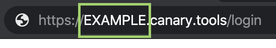
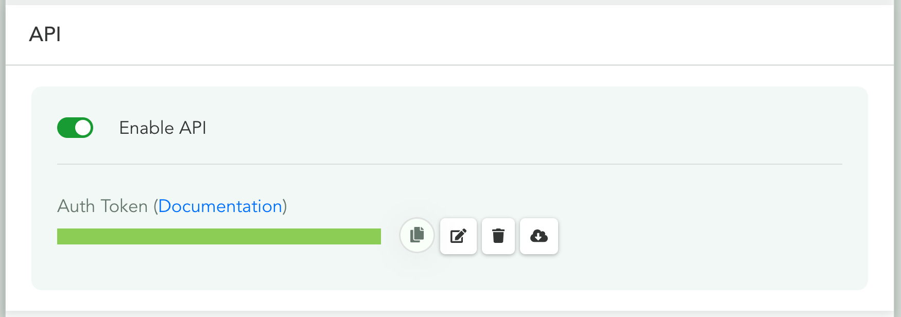

# Getting Started

Welcome to the Canarytools docs!

In this section we'll walk through the basics of connecting to your Console using the API.

Before being able to use the examples, you're going to need to find out your `DOMAIN` and `AUTH_TOKEN`.

#### DOMAIN

This is the unique identifying hash for your Console. It can be trivially determined by navigating to your Console and extracting the leading sub-domain from the url:



#### AUTH_TOKEN

This is the API key that you'll need to use in order to make calls to your API. In order to find your API key, you can navigate to `/settings` in your Console and look for the API section:




## Hello Console

::: api-example GET /api/v1/ping

``` bash
DOMAIN=my_domain
AUTH_TOKEN=test_auth_token

curl -x GET https://${DOMAIN}.canary.tools/api/v1/ping?auth_token=${AUTH_TOKEN}
```
:::

Let's begin by ensuring that we can successfully contact our Console. We can do this by calling the [Ping](/api-reference/miscellaneous#ping) endpoint:

:::: tabs :options="{ useUrlFragment: false }"

::: tab "cURL"

``` bash
DOMAIN=my_domain
AUTH_TOKEN=test_auth_token

curl -x GET https://${DOMAIN}.canary.tools/api/v1/ping?auth_token=${AUTH_TOKEN}
```

:::


::: tab "Python"

``` python
import requests

DOMAIN = 'my_domain'
AUTH_TOKEN = 'test_auth_token'

r = requests.get(
    'https://{DOMAIN}.canary.tools/api/v1/ping?auth_token={AUTH_TOKEN}'.format(
        DOMAIN=DOMAIN, AUTH_TOKEN=AUTH_TOKEN
    )
)
r.json()

```

:::

::::

:::  api-response 
``` json
{
  "result": "success"
}
```
:::

If you see the `success` result you're good to go!

If you instead see an `error` result, you can examine the `message` field to determine what the cause might be. For example, if you used an invalid `auth_token` you would see a response similar to:

::: api-response
```json
{
  "message": "Invalid auth_token",
  "result": "error"
}
```
:::

## Hello Devices

Now that we know we're able to connect to our Console, let's inspect our devices.

By calling the [All Devices](/api-reference/devices#all) endpoint, we'll get a list of our currently paired devices.

:::: tabs :options="{ useUrlFragment: false }"

::: tab "cURL"

``` bash
DOMAIN=my_domain
AUTH_TOKEN=test_auth_token

curl -x GET https://${DOMAIN}.canary.tools/api/v1/devices/all?auth_token=${AUTH_TOKEN}
```

:::


::: tab "Python"

``` python
import requests

DOMAIN = 'my_domain'
AUTH_TOKEN = 'test_auth_token'

r = requests.get(
    'https://{DOMAIN}.canary.tools/api/v1/ping?auth_token={AUTH_TOKEN}'.format(
      DOMAIN=DOMAIN, AUTH_TOKEN=AUTH_TOKEN
    )
)
r.json()

```

:::

::::


::: api-response
```json
{
  "devices": [ ... ],
  "feed": "All Devices",
  "result": "success",
  "updated": "Sat, 01 Jan 2000 00:00:00 GMT",
  "updated_std": "1999-12-31 22:00:00 UTC+0000",
  "updated_timestamp": 946677600
}
```
:::